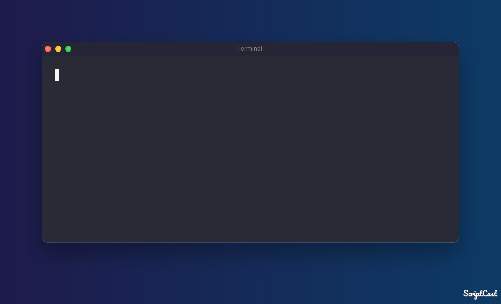

# dev-code

```text
     _                                _
    | |                              | |
  __| | _____   ________ ___ ___   __| | ___
 / _` |/ _ \ \ / /______/ __/ _ \ / _` |/ _ \
| (_| |  __/\ V /      | (_| (_) | (_| |  __/
 \__,_|\___| \_/        \___\___/ \__,_|\___|
  project · editor · container — simplified
```



[](https://github.com/dacrystal/dev-code)
[](https://codecov.io/gh/dacrystal/dev-code)
[](https://pypi.org/project/dev-code/)
[](https://pypi.org/project/dev-code/)
[](LICENSE)

Reusable Dev Containers for any project — without modifying the repository.

## Table of Contents

- [Background](#background)
- [Install](#install)
- [Usage](#usage)
- [API](#api)
- [Configuration](#configuration)
- [Template System](#template-system)
- [File Injection](#file-injection)
- [Contributing](#contributing)
- [License](#license)

---

## Background

`devcode` is a CLI that opens any project in VS Code Dev Containers using reusable, local templates.

Define your environment once and reuse it across projects.

Typical Dev Container workflows involve:

* Copying `.devcontainer/` directories between projects
* Recreating environments repeatedly
* Committing configuration to repositories you do not control

`devcode` separates environment configuration from project code:

* Templates are stored locally
* Projects remain unchanged
* Containers are launched with a single command

---

## Install

### Prerequisites

- VS Code with the [Dev Containers](https://marketplace.visualstudio.com/items?itemName=ms-vscode-remote.remote-containers) extension
- Docker

```bash
pip install dev-code
```

---

## Usage

```bash
# Open a project (auto-detects template from container history, or uses default)
devcode open ~/projects/my-app

# Open with an explicit template
devcode open ~/projects/my-app dev-code
```

### Typical Workflow

```bash
devcode new python-dev
devcode edit python-dev
devcode open ~/projects/my-app python-dev
```

### Project Switching

```bash
devcode ps -a -i
```

Lists containers and allows reopening projects interactively.

### Advanced Options

- Multiple template directories
- Template inheritance
- Verbose debugging (`-v`)
- Dry runs (`--dry-run`)
- Custom container paths

### Internal Flow

1. Validate project path (must exist)
2. Resolve template (explicit → container history → settings default)
3. Launch VS Code Dev Container
4. Apply file injection rules

---

## API

Full reference for all `devcode` commands and flags.

### Global Flags

```bash
-v, --verbose   Enable debug output
```

---

### devcode open

```bash
devcode open <path> [template] [options]
```

Open a project in VS Code using a devcontainer template.

#### Arguments

* `<path>` — Project directory (must exist)

* `[template]` *(optional)*

  * Template name, or
  * Path to a `devcontainer.json`, or
  * Path to a directory containing it

  Paths must start with `./`, `../`, `/`, or `~/`.

  If both a template name and a local directory match, the template takes precedence and a warning is shown.

  **If omitted**, devcode auto-detects the template in this order:
  1. Most recently running container for this project path (uses its stored config)
  2. Most recently stopped container for this project path
  3. `default_template` from `settings.json` (error if not set)

#### Options

| Option                      | Default                 | Description                                                |
| --------------------------- | ----------------------- | ---------------------------------------------------------- |
| `--dry-run`                 | —                       | Print resolved configuration and actions without executing |
| `--container-folder <path>` | `/workspaces/<project>` | Container mount path                                       |
| `--timeout <seconds>`       | `300`                   | Time to wait for container startup                         |

---

### devcode new

```bash
devcode new <name> [base]
```

Create a new template.

| Argument | Default    | Description           |
| -------- | ---------- | --------------------- |
| `[base]` | `dev-code` | Template to copy from |

Options:

```bash
--edit
```

Open the template in VS Code after creation.

---

### devcode edit

```bash
devcode edit [template]
```

* With a name: opens that template
* Without arguments: opens the templates directory

---

### devcode list

```bash
devcode list [--long]
```

| Option   | Description                             |
| -------- | --------------------------------------- |
| `--long` | Show full paths and grouped directories |

---

### devcode ps

```bash
devcode ps [-a] [-i]
```

| Flag | Description                |
| ---- | -------------------------- |
| `-a` | Include stopped containers |
| `-i` | Interactive reopen mode    |

Interactive mode prompts:

```
Open [1-N]:
```

Selecting a number reopens the project in VS Code.

---

### devcode completion

```bash
devcode completion bash
devcode completion zsh
```

Enable in shell:

```bash
eval "$(devcode completion bash)"
```

---

## Configuration

devcode reads `settings.json` from:

```
~/.config/dev-code/settings.json
```

Override the config directory:

```bash
DEVCODE_CONF_DIR=/custom/path devcode open ~/projects/my-app
```

The file is created automatically with defaults on first run.

### settings.json

```json
{
  "template_sources": ["~/.local/share/dev-code/templates"],
  "default_template": "dev-code"
}
```

| Key | Description |
| --- | --- |
| `template_sources` | Ordered list of template directories. First is the write target; rest are read-only. |
| `default_template` | Template used when `devcode open` is called without a template argument and no container history is found. Error if unset. |

---

## Template System

### Default Location

```
~/.local/share/dev-code/templates/
```

Configure additional paths via `template_sources` in `settings.json` (see [Configuration](#configuration)).

---

## File Injection

Inject files from the host into the container at startup.

### Example

```json
{
  "customizations": {
    "dev-code": {
      "cp": [
        {
          "source": "${localEnv:HOME}/.config/myapp",
          "target": "/home/vscode/.config/myapp"
        }
      ]
    }
  }
}
```

---

### Fields

| Field         | Required | Description                            |
| ------------- | -------- | -------------------------------------- |
| `source`      | Yes      | Host path                              |
| `target`      | Yes      | Container path                         |
| `override`    | No       | Skip if target exists (default: false) |
| `owner`       | No       | Requires `group`                       |
| `group`       | No       | Requires `owner`                       |
| `permissions` | No       | chmod applied recursively              |

---

### Source Behavior

* Supports `${localEnv:VAR}`
* Supports relative paths from `.devcontainer/`
* Missing environment variables cause the entry to be skipped

---

### Copy Directory Contents

Use `/.` suffix:

```json
{
  "source": "${localEnv:HOME}/.config/myapp/.",
  "target": "/home/vscode/.config/myapp/"
}
```

Copies directory contents instead of the directory itself.

---

### Behavior Rules

* `target/` copies into the directory
* Without trailing `/` copies as a file or directory
* `override=false` skips existing files
* Ownership and permissions are applied after copying

---

## Contributing

- PRs welcome. Open an issue first for significant changes.
- Run `tox` (or `pytest` for a single-interpreter run) before submitting.

Report bugs or request features in [Issues](https://github.com/dacrystal/dev-code/issues).

---

## License

MIT © Nasser Alansari (dacrystal)
